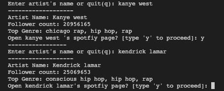

# SpotiPy 
## A personal project to explore and learn use of API's(in particular spotify API)

This project requires [spotipy](https://spotipy.readthedocs.io/en/2.22.1/#) module to work
Advisable to run the program in a python virtual environment
Check for the pip version and upgrade if needed
> pip --version
Install the spotipy module
> pip install spotipy
---------------------------------------------------------------
## Sample

